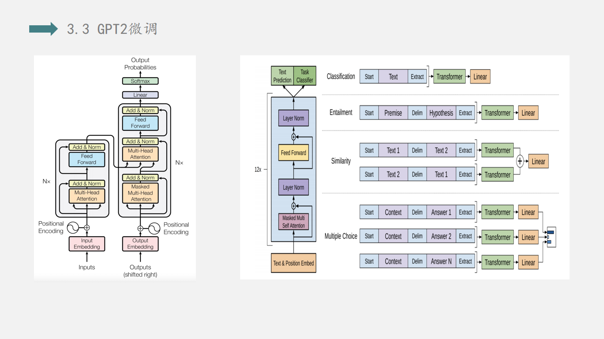

# 数据挖掘大作业-情感分析
[大作业要求](大作业-情感分析-题目说明.pdf) &emsp;[答辩PPT](数据挖掘第五组ppt_final.pdf)
## 1.背景介绍：
### 1.1 任务介绍：
在自然语言处理中，情感分析和观点挖掘是文本数据挖掘领域的一个重要方向。情感分析一般指判断一段文本所表达的情绪状态，属于**文本分类**问题。主要任务是对文本中的主观信息（如观点、情感、评价、态度、情绪等）进行提取、分析、处理、归纳和推理。本次任务中，我们需要通过模型对一段文本进行情绪的正负判断，可以作为一个简单的**二分类**任务。

### 1.2 数据集介绍：
本次使用的数据集从网络上爬取的推文，其中训练集160万条。数据集拥有六个特征，分别是标签、ID、日期、话题、用户以及推文内容。

## 2实验思路：

## 3.具体实现：

------------------

------------------

## 4.思考与展望：
